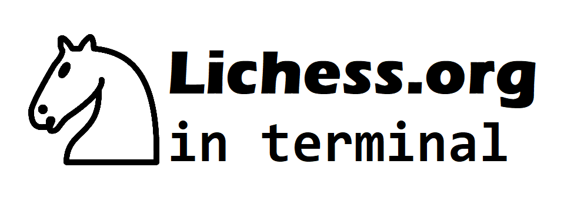

# Lichs



## Info and requirements
* <ins>Uses Lichess</ins>, which means that you need to have a Lichess account
* Operating System: Only Windows for now (see [TODO](https://github.com/Cqsi/lichess_terminal#todo-and-current-questions))
* Only Classical and Rapid games because the Lichess API doesn't allow anything else (quite frankly, Blitz and Bullet like games wouldn't be a lot of fun since you would have to input the coordinates really fast)
* This program uses UCI-format for inputing moves, see the [important section](https://github.com/Cqsi/lichess_terminal#important)

Lichs uses the Lichess API (more exactly [berserk](https://github.com/rhgrant10/berserk)) to make it possible for you to play against other real players directly in the terminal on Lichess servers. <ins>This project is still in its early stages; there's no chat support, pretty bad graphics, no ranked games and probably some bugs.</ins>


## Installation

This package is available on [PyPi](https://pypi.org/project/lichs/), therefore just run:

```
$ pip install lichs
```
and the program will be installed. The next step is to generate a personal API-key.

### How to generate a personal API token

1. Click [here](https://lichess.org/account/oauth/token/create) and log in with your Lichess account if needed
2. Name the token anything (e.g. MyToken)
3. Scroll down and enable the button `Play games with the board API`
4. Click the button `Submit` in the lower right corner
5. Copy the token shown in the brown box
6. Jump into your terminal and write `lichs <api_token>` (put your API token instead of `<api_token>`) and run the command. To get this clear, an example would have been `lichs lzRceo5XOUND74Lm`. You should then see a message to confirm that the API token has been saved. 


## Usage

You start playing by typing the command `lichs` into your terminal:

```
$ lichs
```

That will take you to the intro screen:

```
Welcome to Lichess!

What kind of chess do you want to play?
1. Rapid (10+0)
2. Classical (30+0)

Enter 1 or 2:
```

That should be pretty self-explanatory, you basically choose between Rapid and Classical (the Lichess API doens't support anything else) by entering either 1 or 2. The timing of the games is also listed there; Rapid is 10min and Classical 30min (without extra-time, I might add support for extra-time later)

When you have input either 1 or 2, the program will start to search after an opponent. It shouldn't take long and the game should start pretty quickly.

```
Searching after opponent...
An opponent was found!
```

Then the program will let you know whether you're the color white or black. After that you will start playing; the program will output the board after every move and ask for your move when it's your turn.

```
r n b q k b n r
p p p p p p p p
. . . . . . . .
. . . . . . . .
. . . . . . . .
. . . . P . . .
P P P P . P P P
R N B Q K B N R
```
Above is an example of the board displayed. <ins>Note:</ins> at the moment the board is always displayed from the white's side, because I don't know how to fix this.


### Important
When the program asks for your move, you need to input the move in UCI-format. In UCI-format you specify from <ins>where to where</ins> the move will take place. You don't need to specify what type of piece your moving, the program will know what piece is in the given position.

An example of UCI-format would be `e2e4`. That would move the piece on `e2` to `e4` (as a start-move it's the pawn). Just to get this clear; `Nf3` <ins>wouldn't work</ins>.

The program will inform you if you can't make the move you have input. 


## How to contribute?
If you want to play around with the library, go ahead, it's open-source! I would be really happy if anybody could improve the program (see the TODOs below). 

If you want to test the program, without starting a game against a real player, it's a little tricky. You basically need to create a new account on Lichess, and then go into the `lichs/testing` folder. There you will find pretty much the exact same copy of the `main.py` and `Game.py` files. To specify the API-key in the `main.py` file, you can just use absolute paths to the file containing the API-key, but it really doesn't matter. Then you can run `main.py`, which waits until it gets challenged and then accepts the challenge. This way you can send a challenge from your "real" account and then the program accepts it, which means that you can play against yourself, one from the terminal and the other from the webpage.

### TODO and Current Questions
* Add ability to offer a draw
* Add ability for user to see how much time he/she has left
* Add support for ranked games
* The chessboard that is displayed isn't very nice looking (it's just letters and dots!), but I'm unsure whether CMD allows much better graphics. The goal would be to create something like [this](https://www.reddit.com/r/chess/comments/cm394n/play_chess_against_stockfish_in_your_terminal/) on other systems like Linux for example.
* Make it so that the user can see the chat, maybe in an another terminal window. My plan was to create a second command (e.g. "lichess chat) so that you can open a second terminal window and type the command and then get the chat displayed.
* How do you change the POV (Point Of View) of the chessboard in python-chess? Is it even possible? The current program displays everything from the white's side so if you're black it might be a little weird.

### Useful links 
* https://berserk.readthedocs.io/en/master/installation.html - Python client for the Lichess API
* https://lichess.org/api - Lichess API
* https://lichess.org/api#tag/Board - Lichess Board API
* https://python-chess.readthedocs.io/en/latest/ - python-chess library